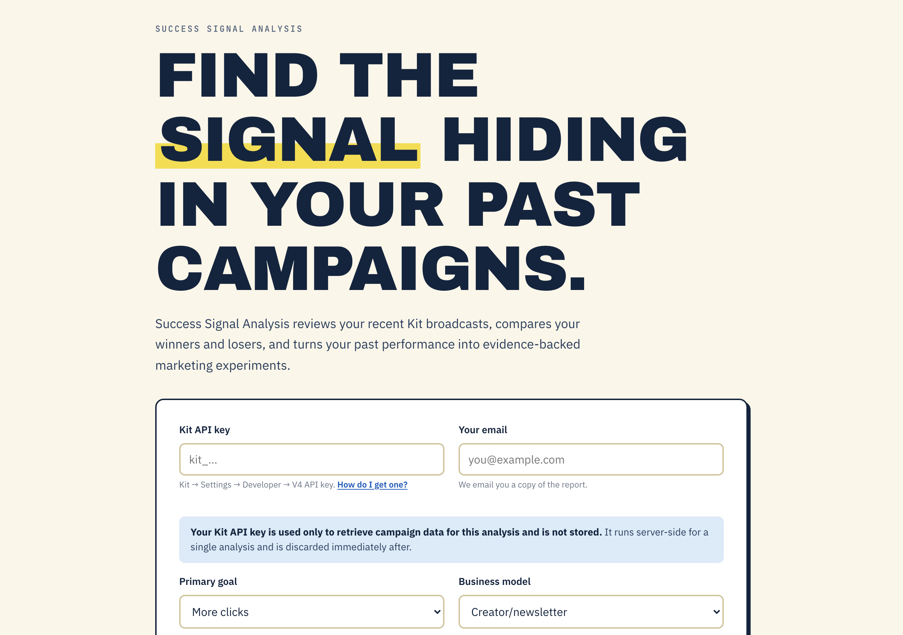
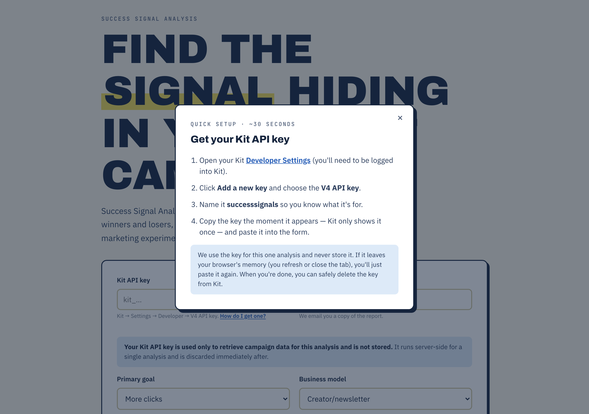
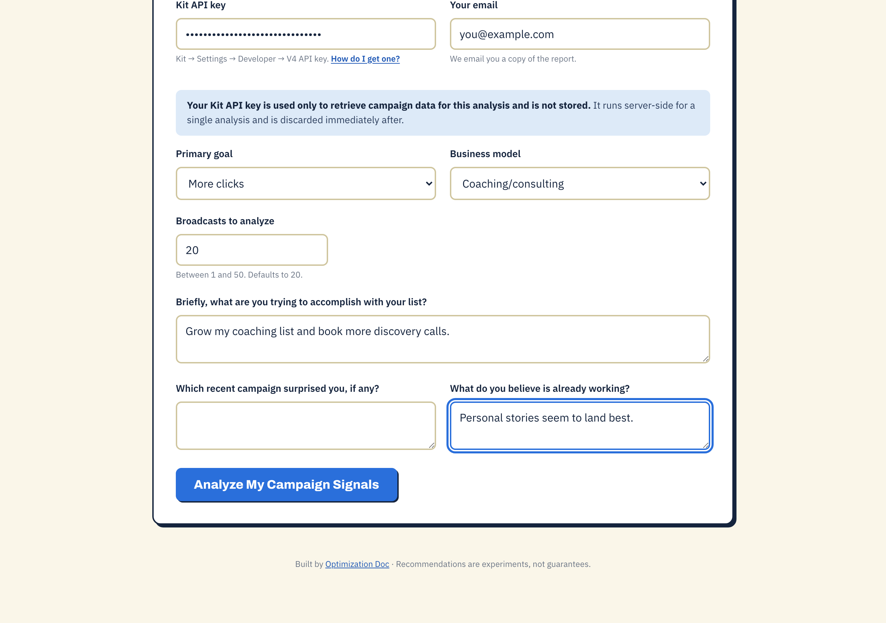
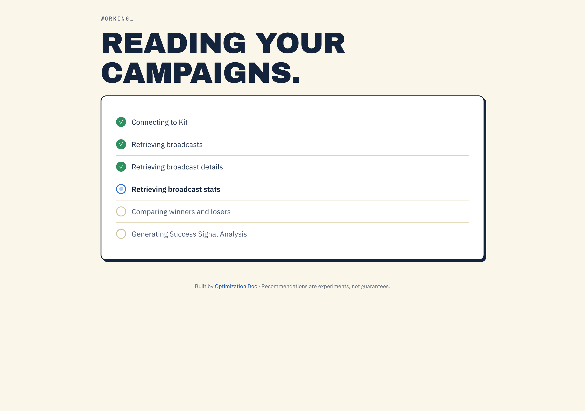
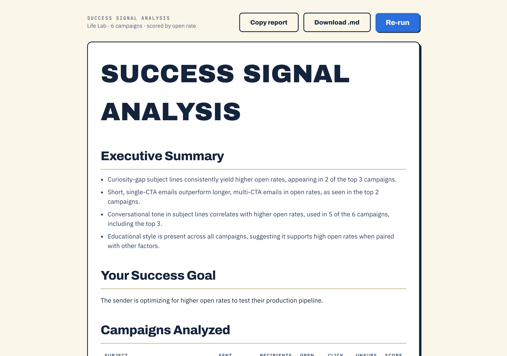
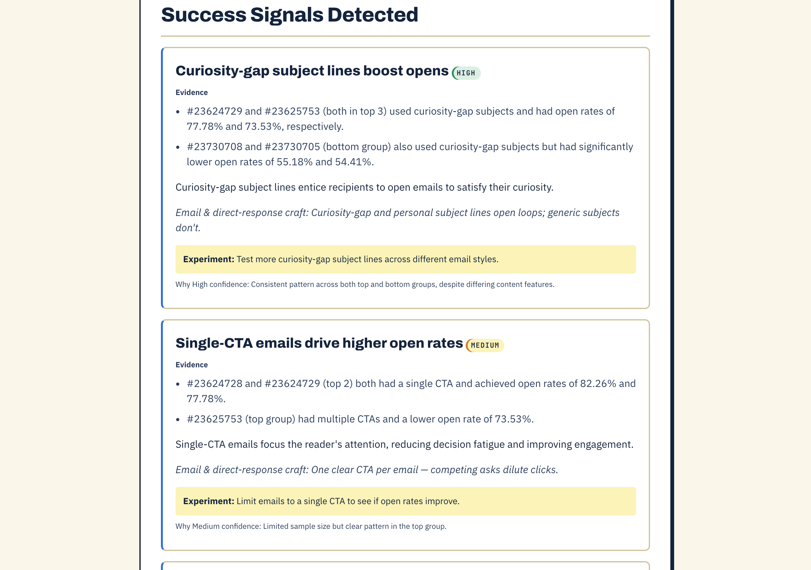
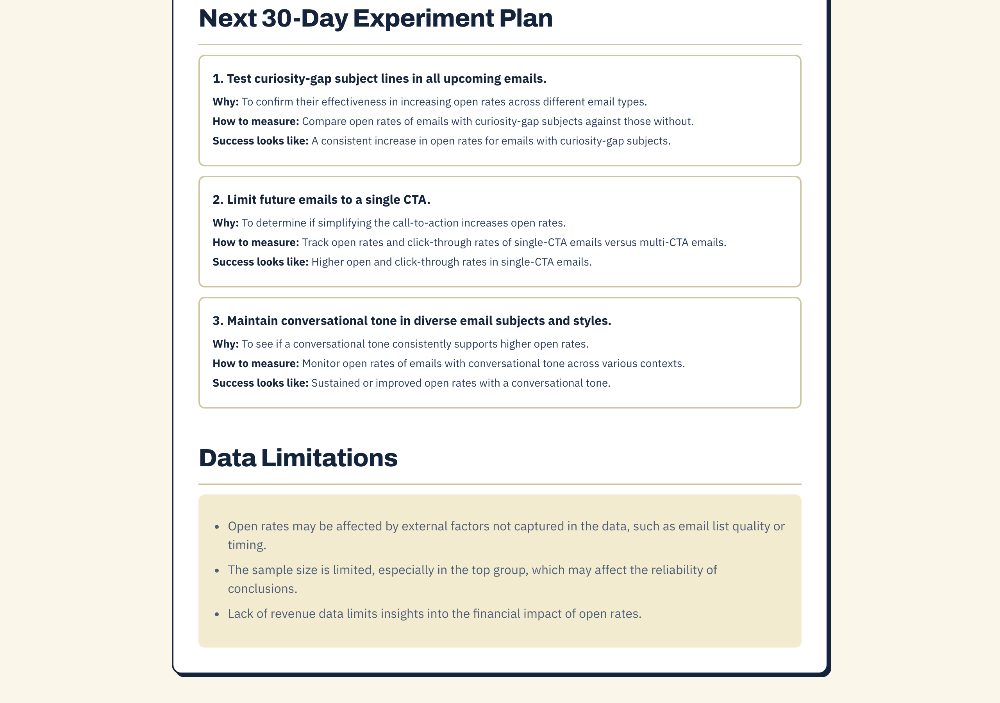

# How to Use Success Signal Analysis

*2026-05-30T00:36:33Z by Showboat 0.6.1*
<!-- showboat-id: 21ec3599-f47e-4c69-9e61-8fb8dc1322a6 -->

**Success Signal Analysis** reviews your recent Kit email broadcasts, compares your best and worst performers, and turns the pattern into evidence-backed experiments. About a minute, no signup — you only need a Kit API key, used once and never stored.

Live at **successsignals.optimizationdoc.com**.

## Step 1 — Open the site

Go to **successsignals.optimizationdoc.com**. One form. Nothing to install, no account to create.

```bash {image}
/Users/jethrojones/jethro/successsignals/tutorial-shots/01-landing.png
```



## Step 2 — Get your Kit API key

Click **"How do I get one?"** under the API-key field. The pop-up walks you through it: open Kit → **Developer Settings**, **Add a new key**, choose the **V4 API key**, name it `successsignals`, and copy it (Kit shows it once). Your key is used for this one analysis and never stored.

```bash {image}
/Users/jethrojones/jethro/successsignals/tutorial-shots/02-get-api-key.png
```



## Step 3 — Tell it your goal

Paste your key and email, then pick your **primary goal** — more opens, clicks, sales, replies, or fewer unsubscribes — plus your business model. The short context questions make the analysis sharper. Press **Analyze My Campaign Signals**.

```bash {image}
/Users/jethrojones/jethro/successsignals/tutorial-shots/03-fill-form.png
```



## Step 4 — It reads your campaigns

Six stages: connecting to Kit, pulling broadcasts and stats, comparing winners vs. losers, and writing the analysis. This is where the key is used — server-side, once, then discarded.

```bash {image}
/Users/jethrojones/jethro/successsignals/tutorial-shots/04-analyzing.png
```



## Step 5 — Your Success Signal Analysis

The report opens with an **Executive Summary** and a table of every campaign — winners flagged green, losers red — each scored on the goal you picked.

```bash {image}
/Users/jethrojones/jethro/successsignals/tutorial-shots/05-report-top.png
```



## Step 6 — Evidence-backed signals

Each **signal** cites specific campaigns as evidence, connects to a marketing principle (only after the evidence, never as proof), gives one concrete experiment, and shows a confidence level. No generic advice — all grounded in your data.

```bash {image}
/Users/jethrojones/jethro/successsignals/tutorial-shots/06-signals.png
```



## Step 7 — Take action and keep it

Finish with a **30-day experiment plan** — what to test, how to measure, what success looks like. **Copy report** or **Download .md** to keep it; a copy is emailed automatically. **Re-run** to try a different goal.

```bash {image}
/Users/jethrojones/jethro/successsignals/tutorial-shots/07-plan-export.png
```



---

**The whole flow:** paste key → pick goal → get an evidence-backed analysis you can act on this month. Recommendations are experiments, not guarantees.
